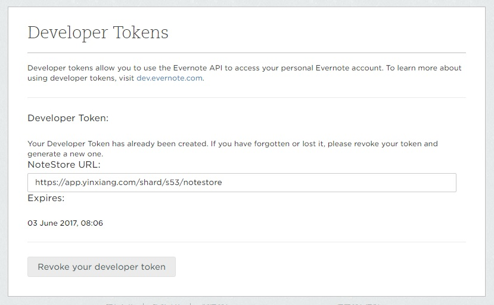

## Features

This extension is much like the [Sublime One](https://packagecontrol.io/packages/Evernote). Just open & update your notes in *MARKDOWN*.

Commands:
* `Evernote: Open Note`
* `Evernote: Update Note`
* `Evernote: Open Developer Page`

## Requirements

You must have an Evernote account :p

## Extension Settings

This is **IMPORTANT**, you have to config correctly to use this extension.

Use command `Evernote: Open Developer Page` to help you get your token & URL. After enter that command (Or your can visit the page directly - [China](https://app.yinxiang.com/api/DeveloperToken.action) | [Other Countries](https://www.evernote.com/api/DeveloperToken.action)), you should see sth like (Of course, you have to login):

Then open your user setting by `Preferences: Open User Settings`, and copy&paste token info to (Search `evernote` to get you there):

* `evernote.token`: your developer token
* `evernote.noteStoreUrl`: your API url

## Known Issues

TODOs:
+ Create
+ Delete
+ Todo-type note
+ blahblah

-----------------------------------------------------------------------------------------------------------

**Enjoy!**
